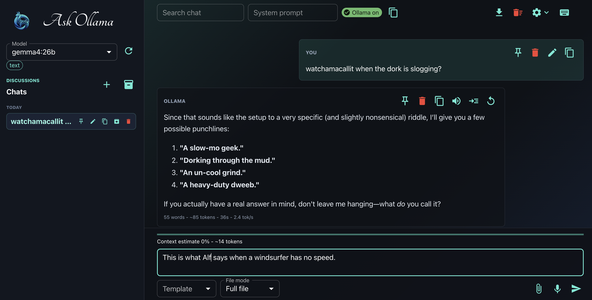

# Ask Ollama

Ask Ollama is a local chat app for Ollama. It has a React + Material UI interface, a Vite web build, and an Electron desktop shell.

## Features

- Chat with any installed Ollama model.
- Stream answers as Ollama writes them.
- Render answers as Markdown, including code blocks, tables, links, and lists.
- Keep multiple saved chats in the left sidebar.
- Resize the left sidebar.
- Group chats by Pinned, Today, Yesterday, and Older.
- Create, switch, and delete chats.
- Undo deleted chats from toast.
- Save chats in browser local storage.
- Remember the selected model per chat.
- Show model badges for text, vision, code, and large-context guesses.
- Refresh installed models from Ollama.
- Use a system prompt to guide future answers.
- Save the system prompt per chat.
- Open a command palette for common actions.
- Search inside the current chat.
- Jump to next and previous search match.
- Highlight matching search text.
- Export a chat as Markdown.
- Export image previews in Markdown.
- Clear the current chat.
- Use starter chips from the empty chat view.
- Edit a user message into a new branch chat.
- Regenerate the latest answer.
- Copy assistant answers.
- Copy individual code blocks.
- Read assistant answers out loud with browser text to speech.
- Dictate prompts with browser speech to text when supported.
- Choose voice, speech speed, and pitch.
- Auto-read new answers.
- Choose mic language.
- Keep mic listening when browser supports it.
- Cancel an active request.
- Stop generation from the active answer.
- See answer time and word count.
- Auto-scroll while new answer text appears.
- Stop auto-scroll when you scroll up.
- Resume auto-scroll when you return near the bottom.
- Attach text files.
- Attach PDFs and extract their text.
- Attach images and send them to vision models.
- Choose full file or first-part file mode for long files.
- Paste images from the clipboard.
- Drag and drop files anywhere in the app.
- Show image thumbnails in the attachment list.
- Show attached image previews in chat messages.
- Click image attachments in messages to preview them.
- Show attachment type and size.
- Warn when a file is large and may exceed model memory.
- Warn when a PDF has no extractable text.
- Warn when an image is attached but the selected model does not look like a vision model.
- Show a clearer error when Ollama is not running.
- Rename chats.
- Pin chats to the top.
- Confirm chat deletion.
- Use prompt templates.
- Use keyboard shortcuts: Cmd/Ctrl+K search, Cmd/Ctrl+N new chat, Esc cancel.
- Open settings for theme, font size, default model, backup, and import.
- See model details from Ollama metadata.
- See a context-size estimate before sending.
- Switch between dark and light theme.
- Back up and restore all chats as JSON.
- Use `src/images/ollama.png` as the app logo, favicon, window icon, and packaged app icon.

## Requirements

- Node.js and npm.
- Ollama running on the machine.
- At least one Ollama model installed.
- A vision model, such as `llava`, if you want image understanding.

## Install

```bash
npm install
```

## Run Web App

```bash
npm run dev
```

Vite proxies Ollama calls from `/api/ollama` to `http://localhost:11434`.

## Build Web App

```bash
npm run build
```

## Run Desktop App

```bash
npm run desktop
```

The desktop app talks directly to `http://localhost:11434`.

## Package Apps

Build Windows portable app:

```bash
npm run dist:win
```

Build Mac app:

```bash
npm run dist:mac
```

Outputs go to `release/`. Ollama must still be running on the target machine.

## Backend Configuration

Default web API base:

```text
/api/ollama
```

Override it with:

```env
VITE_OLLAMA_API_BASE_URL=https://example.com/api/ollama
```

The app uses:

- `GET /api/tags` to load models.
- `POST /api/generate` to stream answers.

## Project Structure

- `src/components/` - React and Material UI components.
- `src/lib/` - Ollama API, file helpers, PDF text, model capability helpers.
- `src/images/ollama.png` - logo and icon image.
- `electron/` - desktop app shell and preload bridge.
- `vite.config.js` - Vite config and Ollama proxy.
- `package.json` - scripts and Electron packaging config.

## Notes

- Attached books and text files are sent as-is, not summarized first.
- Very large files may exceed the selected model context.
- Image attachments need a vision-capable Ollama model.
